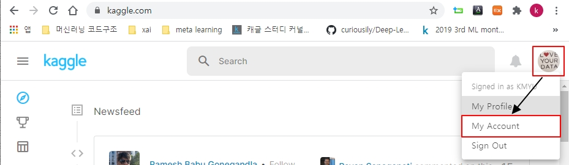
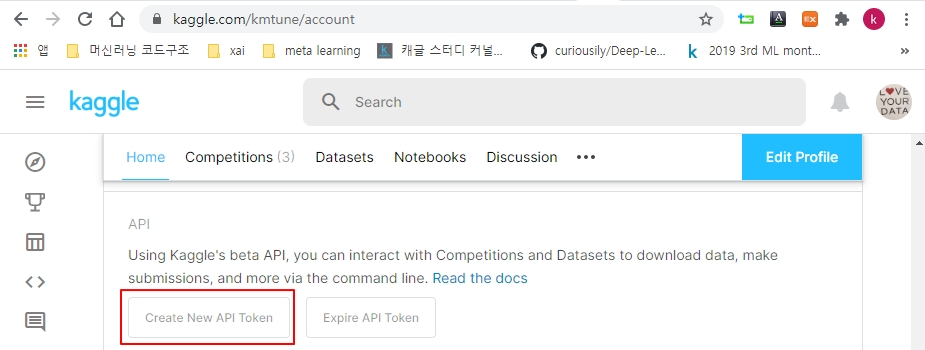
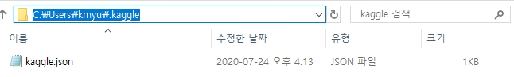
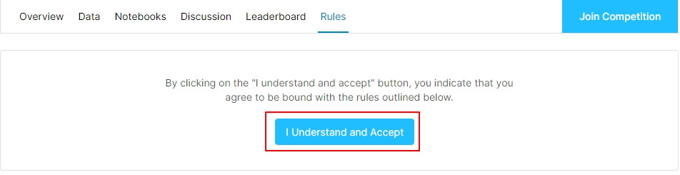
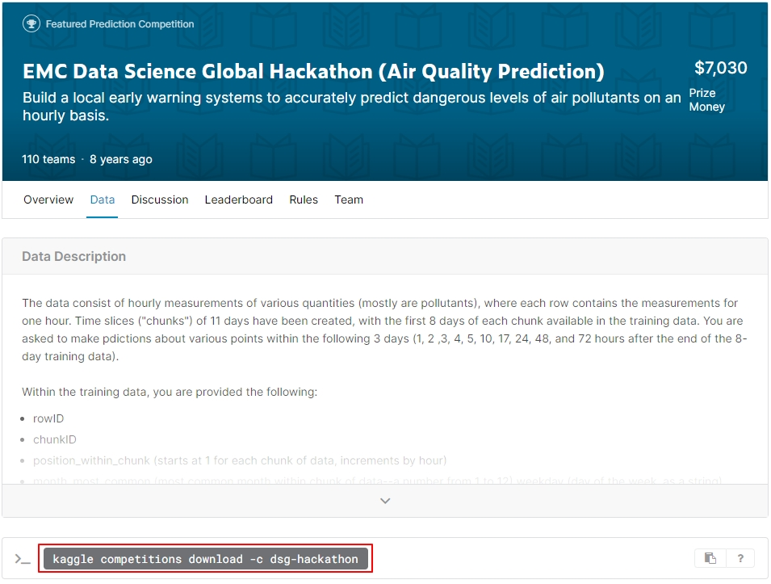
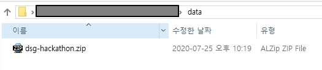
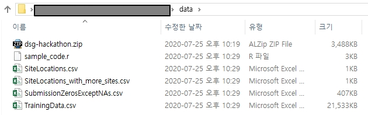

# Data science tips
### Kaggle API로 데이터 다운받기 : window10 기준


- 참고자료 : https://github.com/Kaggle/kaggle-api  


**Author : Kwang Myung Yu**

Initial upload: 2020.07.25  
Last update: 2020.07.25  
##

Kaggle Competition시 로컬환경에서 분석작업을 하고 결과를 제출할 때 유용한 방법이다. 캐글에서 제공하는 Kaggle API를 활용하여 데이터를 다운받고 제출하는 방법에 대하여 설명한다.

### 1. 캐글 계정 가입하기  
`https://www.kaggle.com/`에 방문하여 계정을 생성한다.

### 2. 로컬 PC에 환경설정하기

`pip`로 Kaggle API를 설치한다.


```python
!pip install kaggle
```

    Collecting kaggle
      Downloading kaggle-1.5.6.tar.gz (58 kB)
    Collecting urllib3<1.25,>=1.21.1
      Downloading urllib3-1.24.3-py2.py3-none-any.whl (118 kB)
    Requirement already satisfied: six>=1.10 in c:\users\kmyu\anaconda3\lib\site-packages (from kaggle) (1.14.0)
    Requirement already satisfied: certifi in c:\users\kmyu\anaconda3\lib\site-packages (from kaggle) (2019.11.28)
    Requirement already satisfied: python-dateutil in c:\users\kmyu\anaconda3\lib\site-packages (from kaggle) (2.8.1)
    Requirement already satisfied: requests in c:\users\kmyu\anaconda3\lib\site-packages (from kaggle) (2.22.0)
    Requirement already satisfied: tqdm in c:\users\kmyu\anaconda3\lib\site-packages (from kaggle) (4.42.1)
    Collecting python-slugify
      Downloading python-slugify-4.0.1.tar.gz (11 kB)
    Requirement already satisfied: chardet<3.1.0,>=3.0.2 in c:\users\kmyu\anaconda3\lib\site-packages (from requests->kaggle) (3.0.4)
    Requirement already satisfied: idna<2.9,>=2.5 in c:\users\kmyu\anaconda3\lib\site-packages (from requests->kaggle) (2.8)
    Collecting text-unidecode>=1.3
      Downloading text_unidecode-1.3-py2.py3-none-any.whl (78 kB)
    Building wheels for collected packages: kaggle, python-slugify
      Building wheel for kaggle (setup.py): started
      Building wheel for kaggle (setup.py): finished with status 'done'
      Created wheel for kaggle: filename=kaggle-1.5.6-py3-none-any.whl size=72862 sha256=f72966a0ec1e5233f7f6e87f42bfa7cd46bef4b79c1f94a7cf963dfb4fce0ab9
      Stored in directory: c:\users\kmyu\appdata\local\pip\cache\wheels\aa\e7\e7\eb3c3d514c33294d77ddd5a856bdd58dc9c1fabbed59a02a2b
      Building wheel for python-slugify (setup.py): started
      Building wheel for python-slugify (setup.py): finished with status 'done'
      Created wheel for python-slugify: filename=python_slugify-4.0.1-py2.py3-none-any.whl size=6774 sha256=5732d39d8b13afa18653d162a39663f0cce7c39a24b2e713b8aa33b712e6a85c
      Stored in directory: c:\users\kmyu\appdata\local\pip\cache\wheels\48\1b\6f\5c1cfab22eacbe0095fc619786da6571b55253653c71324b5c
    Successfully built kaggle python-slugify
    Installing collected packages: urllib3, text-unidecode, python-slugify, kaggle
      Attempting uninstall: urllib3
        Found existing installation: urllib3 1.25.8
        Uninstalling urllib3-1.25.8:
          Successfully uninstalled urllib3-1.25.8
    Successfully installed kaggle-1.5.6 python-slugify-4.0.1 text-unidecode-1.3 urllib3-1.24.3


정상 설치여부를 확인한다.


```python
!pip show kaggle
```

    Name: kaggle
    Version: 1.5.6
    Summary: Kaggle API
    Home-page: https://github.com/Kaggle/kaggle-api
    Author: Kaggle
    Author-email: support@kaggle.com
    License: Apache 2.0
    Location: c:\users\kmyu\anaconda3\lib\site-packages
    Requires: requests, tqdm, python-slugify, six, python-dateutil, certifi, urllib3
    Required-by: 


커맨드 창에서 `kaggle`이라는 커맨드를 입력한다.

- 어떤 이유인지 모르겠으나 입력하지 않으면 `C:\Users\kmyu\.kaggle` 폴더가 생성되지 않는다.


- 맨 아래에 `kaggle.json` 없다는 에러 메시지가 나온다.


그전에 `C:\Users\사용자명` 경로에 `.kaggle` 폴더가 생성되었는지 확인한다.

- 본 예제에서는 `C:\Users\kmyu` 이다.  


### 3. Token 다운로드 받기  

- 토큰`kaggle.json` 파일을 다운 받아 `.kaggle` 폴더에 저장한다.

캐글 홈페이지(www.kaggle.com)에 적속하여 로그인한다.  
오른쪽 상단의 계정 아이콘을 클릭하고, `My Account`를 선택한다.




스크롤바를 아래로 내려 `Create New API Token`을 클릭하고,
`kaggle.json` 파일을 다운 받는다.  



`kaggle.json` 파일을 `.kaggle` 폴더에 저장한다.  



이제 다시 커맨드 창이나 노트북에 `kaggle` 을 입력해본다.


```python
!kaggle
```

    usage: kaggle [-h] [-v] {competitions,c,datasets,d,kernels,k,config} ...
    kaggle: error: the following arguments are required: command


### 4. Kaggle API 살펴보기

단순히 `kaggle` 만 입력해본다.


```python
!kaggle
```

    usage: kaggle [-h] [-v] {competitions,c,datasets,d,kernels,k,config} ...
    kaggle: error: the following arguments are required: command


주요 커맨드는 `competition`, `datasets`, `kernels`, `config` 이다.   
이들의 하위 커맨드는 다음과 같다.  
```
kaggle competitions {list, files, download, submit, submissions, leaderboard}
kaggle datasets {list, files, download, create, version, init}
kaggle kernels {list, init, push, pull, output, status}
kaggle config {view, set, unset}
```


#### 4.1 competitions

competition과 관련된 API이다.


```python
!kaggle competition
```

    usage: kaggle [-h] [-v] {competitions,c,datasets,d,kernels,k,config} ...
    kaggle: error: argument command: invalid choice: 'competition' (choose from 'competitions', 'c', 'datasets', 'd', 'kernels', 'k', 'config')


주요 커맨드  
- list : competition 리스트를 보여준다.
- files : competition 파일 리스트를 보여준다.
- download : competition 파일을 다운로드 한다.
- submit : submission 수행
- submissions : 나의 submissions 이력을 보여준다.
- leaderboard : 해당 competition 리더보드 정보를 보여준다.


예를 들어 현재 진행중인 competition 리스트를 보고싶다면 다음을 입력한다.  


```python
!kaggle competitions list
```

    ref                                            deadline             category            reward  teamCount  userHasEntered  
    ---------------------------------------------  -------------------  ---------------  ---------  ---------  --------------  
    tpu-getting-started                            2030-06-03 23:59:00  Getting Started      Kudos        234           False  
    digit-recognizer                               2030-01-01 00:00:00  Getting Started  Knowledge       2906           False  
    titanic                                        2030-01-01 00:00:00  Getting Started  Knowledge      21969            True  
    house-prices-advanced-regression-techniques    2030-01-01 00:00:00  Getting Started  Knowledge       5053            True  
    connectx                                       2030-01-01 00:00:00  Getting Started  Knowledge        827           False  
    nlp-getting-started                            2030-01-01 00:00:00  Getting Started      Kudos       1583           False  
    competitive-data-science-predict-future-sales  2020-12-31 23:59:00  Playground           Kudos       7960           False  
    osic-pulmonary-fibrosis-progression            2020-10-06 23:59:00  Featured           $55,000        449           False  
    halite                                         2020-09-15 23:59:00  Featured              Swag        814           False  
    birdsong-recognition                           2020-09-15 23:59:00  Research           $25,000        495           False  
    landmark-retrieval-2020                        2020-08-17 23:59:00  Research           $25,000        269           False  
    siim-isic-melanoma-classification              2020-08-17 23:59:00  Featured           $30,000       2593           False  
    global-wheat-detection                         2020-08-04 23:59:00  Research           $15,000       2007           False  
    open-images-object-detection-rvc-2020          2020-07-31 16:00:00  Playground       Knowledge         66           False  
    open-images-instance-segmentation-rvc-2020     2020-07-31 16:00:00  Playground       Knowledge         12           False  
    hashcode-photo-slideshow                       2020-07-27 23:59:00  Playground       Knowledge         77           False  
    prostate-cancer-grade-assessment               2020-07-22 23:59:00  Featured           $25,000       1010           False  
    alaska2-image-steganalysis                     2020-07-20 23:59:00  Research           $25,000       1115           False  
    m5-forecasting-accuracy                        2020-06-30 23:59:00  Featured           $50,000       5558           False  
    m5-forecasting-uncertainty                     2020-06-30 23:59:00  Featured           $50,000        909           False  


- 전체 중 일부만(20개) 보여준다. 사실 전체 리스트 첫번째 만 보여준 것이다. 


두번째 페이지를 보려면 `-p 2` 또는 `--page 2` 옵션을 추가하면 된다.


```python
!kaggle competitions list -p 2
```

    ref                                               deadline             category        reward  teamCount  userHasEntered  
    ------------------------------------------------  -------------------  ----------  ----------  ---------  --------------  
    trends-assessment-prediction                      2020-06-29 23:59:00  Research       $25,000       1047           False  
    jigsaw-multilingual-toxic-comment-classification  2020-06-22 23:59:00  Featured       $50,000       1621           False  
    tweet-sentiment-extraction                        2020-06-16 23:59:00  Featured       $15,000       2227           False  
    trec-covid-information-retrieval                  2020-06-03 11:00:00  Research         Kudos         19           False  
    imet-2020-fgvc7                                   2020-05-28 23:59:00  Research     Knowledge         96           False  
    abstraction-and-reasoning-challenge               2020-05-27 23:59:00  Research       $20,000        914           False  
    imaterialist-fashion-2020-fgvc7                   2020-05-26 23:59:00  Research     Knowledge         56           False  
    iwildcam-2020-fgvc7                               2020-05-26 23:59:00  Research     Knowledge        126           False  
    herbarium-2020-fgvc7                              2020-05-26 23:59:00  Research     Knowledge        153           False  
    plant-pathology-2020-fgvc7                        2020-05-26 23:59:00  Research     Knowledge       1317           False  
    liverpool-ion-switching                           2020-05-25 23:59:00  Research       $25,000       2618           False  
    flower-classification-with-tpus                   2020-05-11 23:59:00  Playground      Prizes        848           False  
    covid19-global-forecasting-week-5                 2020-05-11 23:59:00  Research         Kudos        173           False  
    march-madness-analytics-2020                      2020-04-30 23:59:00  Analytics      $25,000          0           False  
    deepfake-detection-challenge                      2020-04-23 22:17:00  Featured    $1,000,000       2265           False  
    covid19-global-forecasting-week-4                 2020-04-15 23:59:00  Research     Knowledge        472           False  
    covid19-global-forecasting-week-3                 2020-04-08 23:59:00  Research     Knowledge        452           False  
    covid19-global-forecasting-week-2                 2020-04-06 03:56:00  Research     Knowledge        215           False  
    cat-in-the-dat-ii                                 2020-03-31 23:59:00  Playground        Swag       1161           False  
    imagenet-object-localization-challenge            2020-03-26 23:59:00  Research     Knowledge         75           False  


원하는 competition 리스트를 보고 싶다면 `-s` 또는 `--search`옵션을 추가하면 된다.  
해당 분야의 competition을 찾는 것이다.  
예를 들어 `energy` 분야 competition 리스트를 찾고 싶다면 다음과 같이 입력한다.


```python
!kaggle competitions list -s energy
```

    ref                                                          deadline             category   reward  teamCount  userHasEntered  
    -----------------------------------------------------------  -------------------  --------  -------  ---------  --------------  
    ashrae-energy-prediction                                     2019-12-19 23:59:00  Featured  $25,000       3614            True  
    belkin-energy-disaggregation-competition                     2013-10-30 23:59:00  Featured  $25,000        165           False  
    ams-2014-solar-energy-prediction-contest                     2013-11-15 23:59:00  Research   $1,000        160           False  
    GEF2012-wind-forecasting                                     2012-10-31 00:00:00  Research   $7,500        133           False  
    global-energy-forecasting-competition-2012-load-forecasting  2012-10-31 00:00:00  Research   $7,500        103           False  
    trackml-particle-identification                              2018-08-13 23:59:00  Featured  $25,000        648           False  


#### 4.2 dataset

competition외에 Kaggle 사이트에 업로드된 데이터와 관련된 API이다.


```python
!kaggle datasets
```

    usage: kaggle datasets [-h]
                           {list,files,download,create,version,init,metadata,status}
                           ...
    kaggle datasets: error: the following arguments are required: command


주요 커맨드  
- list : 데이터셋 리스트를 보여준다.
- files : 데이터셋 파일 리스트를 보여준다.
- download : 데이터셋 파일을 다운로드 한다.
- metadata : 데이터셋과 관련된 메타데이터를 다운받는다.


```python
!kaggle datasets list
```

    ref                                                         title                                             size  lastUpdated          downloadCount  voteCount  usabilityRating  
    ----------------------------------------------------------  -----------------------------------------------  -----  -------------------  -------------  ---------  ---------------  
    roche-data-science-coalition/uncover                        UNCOVER COVID-19 Challenge                       179MB  2020-05-21 18:57:53          16683       1082  0.8235294        
    mrgeislinger/bart-ridership                                 BART Ridership                                   325MB  2020-07-09 22:28:07             72          9  1.0              
    andrewmvd/data-analyst-jobs                                 Data Analyst Jobs                                  2MB  2020-07-14 08:37:57            640         42  1.0              
    vishnuvarthanrao/windows-store                              Windows Store                                     93KB  2020-07-07 12:29:07            384         34  1.0              
    moezabid/zillow-all-homes-data                              Zillow All Homes Data                              5MB  2020-07-18 11:44:48            273         16  0.9411765        
    vzrenggamani/hanacaraka                                     Aksara Jawa / Hanacaraka                           9MB  2020-07-10 15:09:31             18          7  0.9375           
    mrmorj/restaurant-recommendation-challenge                  Restaurant Recommendation Challenge              534MB  2020-07-18 16:25:04            340         27  0.9117647        
    tanmoyx/covid19-patient-precondition-dataset                COVID-19 patient pre-condition dataset             8MB  2020-07-22 16:37:50            413         25  0.9705882        
    garystafford/environmental-sensor-data-132k                 Environmental Sensor Telemetry Data                7MB  2020-07-20 17:18:10             98          7  1.0              
    rohanrao/chai-time-data-science                             Chai Time Data Science | CTDS.Show                 3MB  2020-07-23 17:23:46            487        132  0.9117647        
    mdabbert/ultimate-ufc-dataset                               Ultimate UFC Dataset                             454KB  2020-07-24 14:55:42            328         26  1.0              
    benroshan/factors-affecting-campus-placement                Campus Recruitment                                 5KB  2020-04-11 11:09:02          12082        415  1.0              
    bobbyscience/league-of-legends-diamond-ranked-games-10-min  League of Legends Diamond Ranked Games (10 min)  539KB  2020-04-13 13:53:02           4863        281  1.0              
    fireballbyedimyrnmom/us-counties-covid-19-dataset           US counties COVID 19 dataset                       3MB  2020-07-24 17:40:47          10427        299  0.9411765        
    divyansh22/flight-delay-prediction                          January Flight Delay Prediction                   23MB  2020-04-14 13:15:41           4094        146  1.0              
    clmentbisaillon/fake-and-real-news-dataset                  Fake and real news dataset                        41MB  2020-03-26 18:51:15          10321        468  0.88235295       
    ikiulian/global-hospital-beds-capacity-for-covid19          Global Hospital Beds Capacity (for covid-19)     284KB  2020-04-26 09:39:35           3588         87  1.0              
    praveengovi/coronahack-chest-xraydataset                    CoronaHack -Chest X-Ray-Dataset                    1GB  2020-03-20 01:26:40           4927        227  0.9411765        
    bappekim/air-pollution-in-seoul                             Air Pollution in Seoul                            20MB  2020-04-03 16:33:49           5004        191  1.0              
    kimjihoo/coronavirusdataset                                 Data Science for COVID-19 (DS4C)                   7MB  2020-07-13 14:07:31          48550       1214  1.0              


energy와 관련된 데이터셋 찾기


```python
!kaggle datasets list -s energy
```

    ref                                                             title                                             size  lastUpdated          downloadCount  voteCount  usabilityRating  
    --------------------------------------------------------------  -----------------------------------------------  -----  -------------------  -------------  ---------  ---------------  
    robikscube/hourly-energy-consumption                            Hourly Energy Consumption                         11MB  2018-08-30 14:17:03          17367        434  1.0              
    unitednations/international-energy-statistics                   International Energy Statistics                    7MB  2017-11-16 00:06:06           5399        203  0.7058824        
    lucabasa/dutch-energy                                           Energy consumption of the Netherlands            139MB  2020-06-21 18:51:28           6410        252  0.9411765        
    loveall/appliances-energy-prediction                            Appliances Energy Prediction                       2MB  2017-09-16 10:43:26           2614         76  0.8235294        
    nicholasjhana/energy-consumption-generation-prices-and-weather  Hourly energy demand generation and weather        4MB  2019-10-10 14:02:37           1844         76  1.0              
    lislejoem/us_energy_census_gdp_10-14                            United States Energy, Census, and GDP 2010-2014   37KB  2017-03-25 13:58:43           3098         68  0.8235294        
    navinmundhra/daily-power-generation-in-india-20172020           Daily Power Generation in India (2017-2020)       63KB  2020-06-29 17:13:29           1210         76  1.0              
    sohier/us-energy-statistics                                     US Energy Statistics                             125MB  2017-08-21 22:19:25           1033         43  0.875            
    elikplim/eergy-efficiency-dataset                               Energy Efficiency Dataset                          6KB  2017-09-04 00:46:23            812         16  0.7647059        
    mabusalah/brent-oil-prices                                      Brent Oil Prices                                  35KB  2020-04-29 10:56:55           4763        114  1.0              
    chicago/chicago-energy-usage-2010                               Chicago Energy Usage 2010                         10MB  2019-12-02 23:09:07           1165         29  0.85294116       
    sohier/30-years-of-european-solar-generation                    30 Years of European Solar Generation            147MB  2017-09-14 20:46:44           1979         88  0.8235294        
    khsamaha/solar-flares-rhessi                                    Solar Flares from RHESSI Mission                   3MB  2017-02-09 12:43:46            591         32  0.85294116       
    nathanto/seds-1960-2014F                                        State Energy System Data, 1960-2014                4MB  2017-03-14 15:35:43            493         21  0.8235294        
    jeanmidev/smart-meters-in-london                                Smart meters in London                             2GB  2019-02-22 13:43:24           9211        293  0.8235294        
    uciml/electric-power-consumption-data-set                       Household Electric Power Consumption              19MB  2016-08-23 17:02:15           8475        135  0.75             
    wcukierski/enron-email-dataset                                  The Enron Email Dataset                          358MB  2016-06-16 20:55:19          23649        470  0.7058824        
    teeyee314/ucf-building-meter-reading                            UCF building energy consumption                   15MB  2019-11-26 04:03:12             71          6  0.875            
    residentmario/nyc-building-energy-usage                         NYC Government Building Energy Usage               3KB  2017-10-23 15:22:26            575         20  0.8235294        
    kingburrito666/residential-energy-consumption-survey            Residential Energy Consumption Survey              4MB  2017-03-28 17:38:45            758         14  0.7058824        


### 4. Kaggle API로 데이터셋 다운받기

여기서는 [EMC Data Science Global Hackathon (Air Quality Prediction)](https://www.kaggle.com/c/dsg-hackathon/data) 데이터셋을 다운로드 받는다.  
일단 -h 로 관련 옵션을 살펴본다.


```python
!kaggle competitions download -h
```

    usage: kaggle competitions download [-h] [-f FILE_NAME] [-p PATH] [-w] [-o]
                                        [-q]
                                        [competition]
    
    optional arguments:
      -h, --help            show this help message and exit
      competition           Competition URL suffix (use "kaggle competitions list" to show options)
                            If empty, the default competition will be used (use "kaggle config set competition")"
      -f FILE_NAME, --file FILE_NAME
                            File name, all files downloaded if not provided
                            (use "kaggle competitions files -c <competition>" to show options)
      -p PATH, --path PATH  Folder where file(s) will be downloaded, defaults to current working directory
      -w, --wp              Download files to current working path
      -o, --force           Skip check whether local version of file is up to date, force file download
      -q, --quiet           Suppress printing information about the upload/download progress


먼저 competition 페이지로 가서 `Rules` 탭으로 이동하여 `I Understand and Accept`를 클릭한다.  
competition 데이터의 경우 이 과정을 거쳐야 데이터를 다운 받을 수 있다.




이제 competition 페이지의 `Data` 탭으로 이동한다.  
아래쪽에 데이터를 다운 받기위한 커맨드가 명시되어 있다.  
(본 competition은 특이하게도 Kaggle API를 통해서만 데이터를 받도록 되어 있다.)




실제 competition list에 존재하는지 살펴보자.


```python
!kaggle competitions list -s EMC
```

    ref               deadline             category   reward  teamCount  userHasEntered  
    ----------------  -------------------  --------  -------  ---------  --------------  
    emc-data-science  2012-09-01 23:59:00  Research  $10,000         86           False  
    dsg-hackathon     2012-04-29 12:00:00  Featured   $7,030        110            True  


- 리스트 중 두번째가 해당 `competition`이다.


이제 데이터셋을 다운 받는다. `-c` 옵션을 사용하면 competition 명을 사용하겠다는 뜻이다. 


```python
!kaggle competitions download -c dsg-hackathon
```

    Downloading dsg-hackathon.zip to D:\data\Study


      0%|          | 0.00/3.41M [00:00<?, ?B/s]
     29%|##9       | 1.00M/3.41M [00:00<00:00, 8.41MB/s]
     59%|#####8    | 2.00M/3.41M [00:00<00:00, 8.31MB/s]
     88%|########8 | 3.00M/3.41M [00:00<00:00, 8.36MB/s]
    100%|##########| 3.41M/3.41M [00:00<00:00, 8.51MB/s]


경로명을 지정하지 않으면 디펄트로 현재 디렉토리에 데이터가 저장된다.

원하는 경로에 데이터를 지정하고 싶다면 `-p` 또는 `--path` 옵션을 사용하면 된다.  
만약 현재 디렉토리 하위의 `data`라는 폴더에 저장하고 싶다면 다음과 같이 입력한다.


```python
!kaggle competitions download -c dsg-hackathon -p data
```

    Downloading dsg-hackathon.zip to data


      0%|          | 0.00/3.41M [00:00<?, ?B/s]
     29%|##9       | 1.00M/3.41M [00:00<00:00, 6.78MB/s]
     59%|#####8    | 2.00M/3.41M [00:00<00:00, 6.96MB/s]
     88%|########8 | 3.00M/3.41M [00:00<00:00, 6.97MB/s]
    100%|##########| 3.41M/3.41M [00:00<00:00, 7.10MB/s]




```python
ls data
```

     D 드라이브의 볼륨: 새 볼륨
     볼륨 일련 번호: B884-C06B
    
     D:\data\Study\data 디렉터리
    
    2020-07-25  오후 10:18    <DIR>          .
    2020-07-25  오후 10:18    <DIR>          ..
    2020-07-25  오후 10:19         3,570,912 dsg-hackathon.zip
                   1개 파일           3,570,912 바이트
                   2개 디렉터리  2,719,644,385,280 바이트 남음


- 압축파일로 다운되어 있다.


압축을 풀어본다.


```python
import zipfile
         
data_zip = zipfile.ZipFile('data/dsg-hackathon.zip')
data_zip.extractall('data/')
data_zip.close()
```


```python
ls data
```

     D 드라이브의 볼륨: 새 볼륨
     볼륨 일련 번호: B884-C06B
    
     D:\data\Study\data 디렉터리
    
    2020-07-25  오후 10:18    <DIR>          .
    2020-07-25  오후 10:18    <DIR>          ..
    2020-07-25  오후 10:19         3,570,912 dsg-hackathon.zip
    2020-07-25  오후 10:29             2,425 sample_code.r
    2020-07-25  오후 10:29               553 SiteLocations.csv
    2020-07-25  오후 10:29               775 SiteLocations_with_more_sites.csv
    2020-07-25  오후 10:29           416,595 SubmissionZerosExceptNAs.csv
    2020-07-25  오후 10:29        22,049,177 TrainingData.csv
                   6개 파일          26,040,437 바이트
                   2개 디렉터리  2,719,554,207,744 바이트 남음



- 압축이 풀어진 파일들을 확인할 수 있다.
