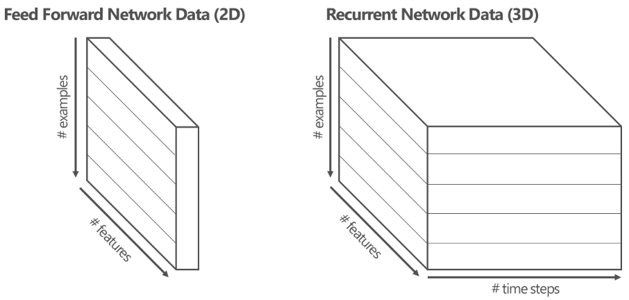
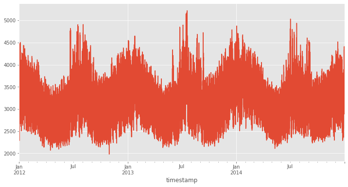

# Data science tips
### Tensorflow LSTM 모델 학습을 위한 데이터셋 만들기
### part1. univariate time series
## 
Author : Kwang Myung Yu 

Initial upload: 2020.08.20 
Last update: 2020.08.20

LSTM 모델을 학습 시킬 때 학습 시킬 시계열 데이터를 조작할 필요가 있다. 데이터 조작을 위한 몇가지 방법에 대하여 살펴본다.

### 1. LSTM 입력 데이터셋 구조



### 2. 데이터셋 (Univerate time series)  
-  GEFCom2014 경진대회에서 사용된 전력부하 데이터 셋을 사용한다.

#### 데이터셋 준비


```python
import numpy as np
import pandas as pd
import matplotlib.pyplot as plt
import seaborn as sns
import datetime
import warnings; warnings.filterwarnings('ignore')
plt.style.use('ggplot')
%matplotlib inline

pd.set_option('display.max_rows', 500)
```


```python
url = 'https://raw.githubusercontent.com/sguys99/datasets/master/energy.csv'
energy = pd.read_csv(url, index_col='timestamp', parse_dates=['timestamp'])
```


```python
energy.head()
```

<table border="1" class="dataframe">
  <thead>
    <tr style="text-align: right;">
      <th></th>
      <th>load</th>
      <th>temp</th>
    </tr>
    <tr>
      <th>timestamp</th>
      <th></th>
      <th></th>
    </tr>
  </thead>
  <tbody>
    <tr>
      <th>2012-01-01 00:00:00</th>
      <td>2698.0</td>
      <td>32.000000</td>
    </tr>
    <tr>
      <th>2012-01-01 01:00:00</th>
      <td>2558.0</td>
      <td>32.666667</td>
    </tr>
    <tr>
      <th>2012-01-01 02:00:00</th>
      <td>2444.0</td>
      <td>30.000000</td>
    </tr>
    <tr>
      <th>2012-01-01 03:00:00</th>
      <td>2402.0</td>
      <td>31.000000</td>
    </tr>
    <tr>
      <th>2012-01-01 04:00:00</th>
      <td>2403.0</td>
      <td>32.000000</td>
    </tr>
  </tbody>
</table>


```python
energy.shape
```


    (26304, 2)


여기서는 load column만 사용한다.


```python
series = energy['load']
```


```python
series.head()
```


    timestamp
    2012-01-01 00:00:00    2698.0
    2012-01-01 01:00:00    2558.0
    2012-01-01 02:00:00    2444.0
    2012-01-01 03:00:00    2402.0
    2012-01-01 04:00:00    2403.0
    Name: load, dtype: float64


```python
series.plot(figsize = (12, 6))
```




### 3. 기존의 방법들

#### 방법1 : pandas의 shift 활용


```python
df = pd.DataFrame(index=series.index)
cols = list()
n_steps = 5
for i in range (1, n_steps):
    col = 'X(t-{})'.format(n_steps-i)
    cols.append(col)
    df[col] = series.shift(periods = n_steps-i)
df['X(t)'] = series.values
df['y'] = series.shift(periods = -1)

df = df.dropna(how = 'any')
```


```python
df
```

<table border="1" class="dataframe">
  <thead>
    <tr style="text-align: right;">
      <th></th>
      <th>X(t-4)</th>
      <th>X(t-3)</th>
      <th>X(t-2)</th>
      <th>X(t-1)</th>
      <th>X(t)</th>
      <th>y</th>
    </tr>
    <tr>
      <th>timestamp</th>
      <th></th>
      <th></th>
      <th></th>
      <th></th>
      <th></th>
      <th></th>
    </tr>
  </thead>
  <tbody>
    <tr>
      <th>2012-01-01 04:00:00</th>
      <td>2698.0</td>
      <td>2558.0</td>
      <td>2444.0</td>
      <td>2402.0</td>
      <td>2403.0</td>
      <td>2453.0</td>
    </tr>
    <tr>
      <th>2012-01-01 05:00:00</th>
      <td>2558.0</td>
      <td>2444.0</td>
      <td>2402.0</td>
      <td>2403.0</td>
      <td>2453.0</td>
      <td>2560.0</td>
    </tr>
    <tr>
      <th>2012-01-01 06:00:00</th>
      <td>2444.0</td>
      <td>2402.0</td>
      <td>2403.0</td>
      <td>2453.0</td>
      <td>2560.0</td>
      <td>2719.0</td>
    </tr>
    <tr>
      <th>2012-01-01 07:00:00</th>
      <td>2402.0</td>
      <td>2403.0</td>
      <td>2453.0</td>
      <td>2560.0</td>
      <td>2719.0</td>
      <td>2916.0</td>
    </tr>
    <tr>
      <th>2012-01-01 08:00:00</th>
      <td>2403.0</td>
      <td>2453.0</td>
      <td>2560.0</td>
      <td>2719.0</td>
      <td>2916.0</td>
      <td>3105.0</td>
    </tr>
    <tr>
      <th>...</th>
      <td>...</td>
      <td>...</td>
      <td>...</td>
      <td>...</td>
      <td>...</td>
      <td>...</td>
    </tr>
    <tr>
      <th>2014-12-31 18:00:00</th>
      <td>3893.0</td>
      <td>3912.0</td>
      <td>4141.0</td>
      <td>4319.0</td>
      <td>4199.0</td>
      <td>4012.0</td>
    </tr>
    <tr>
      <th>2014-12-31 19:00:00</th>
      <td>3912.0</td>
      <td>4141.0</td>
      <td>4319.0</td>
      <td>4199.0</td>
      <td>4012.0</td>
      <td>3856.0</td>
    </tr>
    <tr>
      <th>2014-12-31 20:00:00</th>
      <td>4141.0</td>
      <td>4319.0</td>
      <td>4199.0</td>
      <td>4012.0</td>
      <td>3856.0</td>
      <td>3671.0</td>
    </tr>
    <tr>
      <th>2014-12-31 21:00:00</th>
      <td>4319.0</td>
      <td>4199.0</td>
      <td>4012.0</td>
      <td>3856.0</td>
      <td>3671.0</td>
      <td>3499.0</td>
    </tr>
    <tr>
      <th>2014-12-31 22:00:00</th>
      <td>4199.0</td>
      <td>4012.0</td>
      <td>3856.0</td>
      <td>3671.0</td>
      <td>3499.0</td>
      <td>3345.0</td>
    </tr>
  </tbody>
</table>
<p>26299 rows × 6 columns</p>


함수로 만들기


```python
def prep_data1(series, n_steps, dropna = True):
    if not isinstance(series, pd.Series): #y가 pd.Series에 적합한 인자인지 확인, 
                                     # ex) isinstance(1.2, int) => False가 리턴
        series = pd.Series(series)
    
    df = pd.DataFrame(index=series.index)
    cols = list()

    for i in range (1, n_steps):
        col = 'X(t-{})'.format(n_steps-i)
        cols.append(col)
        df[col] = series.shift(periods = n_steps-i)
    df['X(t)'] = series.values
    df['y'] = series.shift(periods = -1)

    if dropna:
        df = df.dropna(how = 'any')
        
    return df
```


```python
data = prep_data1(series, 5)
data.head()
```

<table border="1" class="dataframe">
  <thead>
    <tr style="text-align: right;">
      <th></th>
      <th>X(t-4)</th>
      <th>X(t-3)</th>
      <th>X(t-2)</th>
      <th>X(t-1)</th>
      <th>X(t)</th>
      <th>y</th>
    </tr>
    <tr>
      <th>timestamp</th>
      <th></th>
      <th></th>
      <th></th>
      <th></th>
      <th></th>
      <th></th>
    </tr>
  </thead>
  <tbody>
    <tr>
      <th>2012-01-01 04:00:00</th>
      <td>2698.0</td>
      <td>2558.0</td>
      <td>2444.0</td>
      <td>2402.0</td>
      <td>2403.0</td>
      <td>2453.0</td>
    </tr>
    <tr>
      <th>2012-01-01 05:00:00</th>
      <td>2558.0</td>
      <td>2444.0</td>
      <td>2402.0</td>
      <td>2403.0</td>
      <td>2453.0</td>
      <td>2560.0</td>
    </tr>
    <tr>
      <th>2012-01-01 06:00:00</th>
      <td>2444.0</td>
      <td>2402.0</td>
      <td>2403.0</td>
      <td>2453.0</td>
      <td>2560.0</td>
      <td>2719.0</td>
    </tr>
    <tr>
      <th>2012-01-01 07:00:00</th>
      <td>2402.0</td>
      <td>2403.0</td>
      <td>2453.0</td>
      <td>2560.0</td>
      <td>2719.0</td>
      <td>2916.0</td>
    </tr>
    <tr>
      <th>2012-01-01 08:00:00</th>
      <td>2403.0</td>
      <td>2453.0</td>
      <td>2560.0</td>
      <td>2719.0</td>
      <td>2916.0</td>
      <td>3105.0</td>
    </tr>
  </tbody>
</table>


#### 방법2 : numpy의 array 활용


```python
index, sequence = series.index, series.values
n_steps = 5
```


```python
X, y = list(), list()
for i in range(len(sequence)):
    end_ix = i+n_steps
    if end_ix > len(sequence)-1 :
        break
    
    seq_x, seq_y = sequence[i:end_ix], sequence[end_ix]
    X.append(seq_x)
    y.append(seq_y)
X = np.array(X)
y = np.array(y)

data = np.hstack((X, y.reshape(-1,1)))
```


```python
cols = ['X(t-{})'.format(n_steps-i) for i in range(1, n_steps)]
cols.append('X(t)')
cols.append('y')
```


```python
data = pd.DataFrame(index=index[n_steps-1:-1], columns=cols, data=data)
```


```python
data
```

<table border="1" class="dataframe">
  <thead>
    <tr style="text-align: right;">
      <th></th>
      <th>X(t-4)</th>
      <th>X(t-3)</th>
      <th>X(t-2)</th>
      <th>X(t-1)</th>
      <th>X(t)</th>
      <th>y</th>
    </tr>
    <tr>
      <th>timestamp</th>
      <th></th>
      <th></th>
      <th></th>
      <th></th>
      <th></th>
      <th></th>
    </tr>
  </thead>
  <tbody>
    <tr>
      <th>2012-01-01 04:00:00</th>
      <td>2698.0</td>
      <td>2558.0</td>
      <td>2444.0</td>
      <td>2402.0</td>
      <td>2403.0</td>
      <td>2453.0</td>
    </tr>
    <tr>
      <th>2012-01-01 05:00:00</th>
      <td>2558.0</td>
      <td>2444.0</td>
      <td>2402.0</td>
      <td>2403.0</td>
      <td>2453.0</td>
      <td>2560.0</td>
    </tr>
    <tr>
      <th>2012-01-01 06:00:00</th>
      <td>2444.0</td>
      <td>2402.0</td>
      <td>2403.0</td>
      <td>2453.0</td>
      <td>2560.0</td>
      <td>2719.0</td>
    </tr>
    <tr>
      <th>2012-01-01 07:00:00</th>
      <td>2402.0</td>
      <td>2403.0</td>
      <td>2453.0</td>
      <td>2560.0</td>
      <td>2719.0</td>
      <td>2916.0</td>
    </tr>
    <tr>
      <th>2012-01-01 08:00:00</th>
      <td>2403.0</td>
      <td>2453.0</td>
      <td>2560.0</td>
      <td>2719.0</td>
      <td>2916.0</td>
      <td>3105.0</td>
    </tr>
    <tr>
      <th>...</th>
      <td>...</td>
      <td>...</td>
      <td>...</td>
      <td>...</td>
      <td>...</td>
      <td>...</td>
    </tr>
    <tr>
      <th>2014-12-31 18:00:00</th>
      <td>3893.0</td>
      <td>3912.0</td>
      <td>4141.0</td>
      <td>4319.0</td>
      <td>4199.0</td>
      <td>4012.0</td>
    </tr>
    <tr>
      <th>2014-12-31 19:00:00</th>
      <td>3912.0</td>
      <td>4141.0</td>
      <td>4319.0</td>
      <td>4199.0</td>
      <td>4012.0</td>
      <td>3856.0</td>
    </tr>
    <tr>
      <th>2014-12-31 20:00:00</th>
      <td>4141.0</td>
      <td>4319.0</td>
      <td>4199.0</td>
      <td>4012.0</td>
      <td>3856.0</td>
      <td>3671.0</td>
    </tr>
    <tr>
      <th>2014-12-31 21:00:00</th>
      <td>4319.0</td>
      <td>4199.0</td>
      <td>4012.0</td>
      <td>3856.0</td>
      <td>3671.0</td>
      <td>3499.0</td>
    </tr>
    <tr>
      <th>2014-12-31 22:00:00</th>
      <td>4199.0</td>
      <td>4012.0</td>
      <td>3856.0</td>
      <td>3671.0</td>
      <td>3499.0</td>
      <td>3345.0</td>
    </tr>
  </tbody>
</table>
<p>26299 rows × 6 columns</p>


함수로 만들기


```python
def prep_data2(series, n_steps):
    if not isinstance(series, pd.Series): 
        series = pd.Series(series)
        
    index, sequence = series.index, series.values
    
    X, y = list(), list()
    for i in range(len(sequence)):
        end_ix = i+n_steps
        
        if end_ix > len(sequence)-1 :
            break
    
        seq_x, seq_y = sequence[i:end_ix], sequence[end_ix]
        X.append(seq_x)
        y.append(seq_y)
        
    X = np.array(X)
    y = np.array(y)
    
    data = np.hstack((X, y.reshape(-1,1)))
        
    cols = ['X(t-{})'.format(n_steps-i) for i in range(1, n_steps)]
    cols.append('X(t)')
    cols.append('y')
    
    df = pd.DataFrame(index=index[n_steps-1:-1], 
                      columns=cols, data=data)
    
    return df
```


```python
data = prep_data2(series, 5)
```


```python
data
```

<table border="1" class="dataframe">
  <thead>
    <tr style="text-align: right;">
      <th></th>
      <th>X(t-4)</th>
      <th>X(t-3)</th>
      <th>X(t-2)</th>
      <th>X(t-1)</th>
      <th>X(t)</th>
      <th>y</th>
    </tr>
    <tr>
      <th>timestamp</th>
      <th></th>
      <th></th>
      <th></th>
      <th></th>
      <th></th>
      <th></th>
    </tr>
  </thead>
  <tbody>
    <tr>
      <th>2012-01-01 04:00:00</th>
      <td>2698.0</td>
      <td>2558.0</td>
      <td>2444.0</td>
      <td>2402.0</td>
      <td>2403.0</td>
      <td>2453.0</td>
    </tr>
    <tr>
      <th>2012-01-01 05:00:00</th>
      <td>2558.0</td>
      <td>2444.0</td>
      <td>2402.0</td>
      <td>2403.0</td>
      <td>2453.0</td>
      <td>2560.0</td>
    </tr>
    <tr>
      <th>2012-01-01 06:00:00</th>
      <td>2444.0</td>
      <td>2402.0</td>
      <td>2403.0</td>
      <td>2453.0</td>
      <td>2560.0</td>
      <td>2719.0</td>
    </tr>
    <tr>
      <th>2012-01-01 07:00:00</th>
      <td>2402.0</td>
      <td>2403.0</td>
      <td>2453.0</td>
      <td>2560.0</td>
      <td>2719.0</td>
      <td>2916.0</td>
    </tr>
    <tr>
      <th>2012-01-01 08:00:00</th>
      <td>2403.0</td>
      <td>2453.0</td>
      <td>2560.0</td>
      <td>2719.0</td>
      <td>2916.0</td>
      <td>3105.0</td>
    </tr>
    <tr>
      <th>...</th>
      <td>...</td>
      <td>...</td>
      <td>...</td>
      <td>...</td>
      <td>...</td>
      <td>...</td>
    </tr>
    <tr>
      <th>2014-12-31 18:00:00</th>
      <td>3893.0</td>
      <td>3912.0</td>
      <td>4141.0</td>
      <td>4319.0</td>
      <td>4199.0</td>
      <td>4012.0</td>
    </tr>
    <tr>
      <th>2014-12-31 19:00:00</th>
      <td>3912.0</td>
      <td>4141.0</td>
      <td>4319.0</td>
      <td>4199.0</td>
      <td>4012.0</td>
      <td>3856.0</td>
    </tr>
    <tr>
      <th>2014-12-31 20:00:00</th>
      <td>4141.0</td>
      <td>4319.0</td>
      <td>4199.0</td>
      <td>4012.0</td>
      <td>3856.0</td>
      <td>3671.0</td>
    </tr>
    <tr>
      <th>2014-12-31 21:00:00</th>
      <td>4319.0</td>
      <td>4199.0</td>
      <td>4012.0</td>
      <td>3856.0</td>
      <td>3671.0</td>
      <td>3499.0</td>
    </tr>
    <tr>
      <th>2014-12-31 22:00:00</th>
      <td>4199.0</td>
      <td>4012.0</td>
      <td>3856.0</td>
      <td>3671.0</td>
      <td>3499.0</td>
      <td>3345.0</td>
    </tr>
  </tbody>
</table>
<p>26299 rows × 6 columns</p>


### 4. tensorflow.data.Dataset 활용하기
- tensorflow 2를 사용한다면 tf.data.Dataset API로 input pipleline을 구축할 수도 있다.


```python
import tensorflow as tf
```

#### 4.1 주요개념

from_tensor_slice로 데이터셋 구축하기


```python
data = [i for i in range(10)]
dataset = tf.data.Dataset.from_tensor_slices(data)
```


```python
dataset
```


    <TensorSliceDataset shapes: (), types: tf.int32>


dataset을 사용하려면 루프를 구동해야 한다.


```python
for element in dataset:
    print(element)
```

    tf.Tensor(0, shape=(), dtype=int32)
    tf.Tensor(1, shape=(), dtype=int32)
    tf.Tensor(2, shape=(), dtype=int32)
    tf.Tensor(3, shape=(), dtype=int32)
    tf.Tensor(4, shape=(), dtype=int32)
    tf.Tensor(5, shape=(), dtype=int32)
    tf.Tensor(6, shape=(), dtype=int32)
    tf.Tensor(7, shape=(), dtype=int32)
    tf.Tensor(8, shape=(), dtype=int32)
    tf.Tensor(9, shape=(), dtype=int32)


- 텐서로 저장되어 있다.

  

numpy로 출력하는 방법


```python
for element in dataset:
    print(element.numpy())
```

    0
    1
    2
    3
    4
    5
    6
    7
    8
    9


window를 사용하여 데이터를 time steps 단위로 쪼개서 저장하기


```python
n_steps = 5
data = [i for i in range(10)]
dataset = tf.data.Dataset.from_tensor_slices(data)

dataset = dataset.window(n_steps, shift = 1)
```


```python
for window_data in dataset:
    print(window_data)
```

    <_VariantDataset shapes: (), types: tf.int32>
    <_VariantDataset shapes: (), types: tf.int32>
    <_VariantDataset shapes: (), types: tf.int32>
    <_VariantDataset shapes: (), types: tf.int32>
    <_VariantDataset shapes: (), types: tf.int32>
    <_VariantDataset shapes: (), types: tf.int32>
    <_VariantDataset shapes: (), types: tf.int32>
    <_VariantDataset shapes: (), types: tf.int32>
    <_VariantDataset shapes: (), types: tf.int32>
    <_VariantDataset shapes: (), types: tf.int32>


- 윈도우 단위로 element 들을 확인할 수 없다.

  

element 확인하기


```python
n_steps = 5
data = [i for i in range(10)]
dataset = tf.data.Dataset.from_tensor_slices(data)
dataset = dataset.window(n_steps, shift = 1)

for window_data in dataset:
    for element in window_data:
        print(element.numpy())
    print()
```

    0
    1
    2
    3
    4
    
    1
    2
    3
    4
    5
    
    2
    3
    4
    5
    6
    
    3
    4
    5
    6
    7
    
    4
    5
    6
    7
    8
    
    5
    6
    7
    8
    9
    
    6
    7
    8
    9
    
    7
    8
    9
    
    8
    9
    
    9

- 5개 단위로 출력되는 것을 확인할수 있다.  

- 뒷부분 루프에서는 window size 5를 충족시키기 못한다.

  

다시 표현하기


```python
n_steps = 5
data = [i for i in range(10)]
dataset = tf.data.Dataset.from_tensor_slices(data)
dataset = dataset.window(n_steps, shift = 1)

for window_data in dataset:
    for element in window_data:
        print(element.numpy(), end = ' ') #프린트 명령을 \n이 아니라 ' '로 끝내기
    print()
```

    0 1 2 3 4 
    1 2 3 4 5 
    2 3 4 5 6 
    3 4 5 6 7 
    4 5 6 7 8 
    5 6 7 8 9 
    6 7 8 9 
    7 8 9 
    8 9 
    9 


n_steps=5를 충족시키지 못하는 window_data를 버리기


```python
n_steps = 5
data = [i for i in range(10)]
dataset = tf.data.Dataset.from_tensor_slices(data)
dataset = dataset.window(n_steps, shift = 1, drop_remainder = True)

for window_data in dataset:
    for element in window_data:
        print(element.numpy(), end = ' ') #프린트 명령을 \n이 아니라 ' '로 끝내기
    print()
```

    0 1 2 3 4 
    1 2 3 4 5 
    2 3 4 5 6 
    3 4 5 6 7 
    4 5 6 7 8 
    5 6 7 8 9 


- 여전히 데이터가 array로 묶여있지 않다.


flat_map, window.batch를 사용하여 array 형태로 만들기

- 위에서 window_data는 `_VariantDataset` 타입이다.  
- window 크기(n_steps) 만큼 배치로 읽어들이고(window.batch), 결과를 flatten하게 펼치는 flatten_map을 사용한다.


```python
n_steps = 5
data = [i for i in range(10)]
dataset = tf.data.Dataset.from_tensor_slices(data)
dataset = dataset.window(n_steps, shift = 1, drop_remainder = True)
dataset = dataset.flat_map(lambda window: window.batch(n_steps))

for window_data in dataset:
    print(window_data)
```

    tf.Tensor([0 1 2 3 4], shape=(5,), dtype=int32)
    tf.Tensor([1 2 3 4 5], shape=(5,), dtype=int32)
    tf.Tensor([2 3 4 5 6], shape=(5,), dtype=int32)
    tf.Tensor([3 4 5 6 7], shape=(5,), dtype=int32)
    tf.Tensor([4 5 6 7 8], shape=(5,), dtype=int32)
    tf.Tensor([5 6 7 8 9], shape=(5,), dtype=int32)


```python
n_steps = 5
data = [i for i in range(10)]
dataset = tf.data.Dataset.from_tensor_slices(data)
dataset = dataset.window(n_steps, shift = 1, drop_remainder = True)
dataset = dataset.flat_map(lambda window: window.batch(n_steps))

for window_data in dataset:
    print(window_data.numpy())
```

    [0 1 2 3 4]
    [1 2 3 4 5]
    [2 3 4 5 6]
    [3 4 5 6 7]
    [4 5 6 7 8]
    [5 6 7 8 9]


데이터를 X, y 형태로 구분하기


```python
n_steps = 5
data = [i for i in range(10)]
dataset = tf.data.Dataset.from_tensor_slices(data)
dataset = dataset.window(n_steps, shift = 1, drop_remainder = True)
dataset = dataset.flat_map(lambda window: window.batch(n_steps))
dataset = dataset.map(lambda window: (window[:-1], window[-1:]))

for X,y in dataset:
    print(X.numpy(), y.numpy())
```

    [0 1 2 3] [4]
    [1 2 3 4] [5]
    [2 3 4 5] [6]
    [3 4 5 6] [7]
    [4 5 6 7] [8]
    [5 6 7 8] [9]


데이터 shuffling 하기


```python
n_steps = 5
data = [i for i in range(10)]
dataset = tf.data.Dataset.from_tensor_slices(data)
dataset = dataset.window(n_steps, shift = 1, drop_remainder = True)
dataset = dataset.flat_map(lambda window: window.batch(5))
dataset = dataset.map(lambda window: (window[:-1], window[-1:]))
dataset = dataset.shuffle(buffer_size=10)
# 완벽한 셔플링을 하려면 전체 데이터크기보다 buffer_size가 더 커야함
for X,y in dataset:
    print(X.numpy(), y.numpy())
```

    [5 6 7 8] [9]
    [1 2 3 4] [5]
    [0 1 2 3] [4]
    [2 3 4 5] [6]
    [3 4 5 6] [7]
    [4 5 6 7] [8]


데이터를 배치 단위로 나누기


```python
n_steps = 5
data = [i for i in range(10)]
dataset = tf.data.Dataset.from_tensor_slices(data)
dataset = dataset.window(n_steps, shift = 1, drop_remainder = True)
dataset = dataset.flat_map(lambda window: window.batch(5))
dataset = dataset.map(lambda window: (window[:-1], window[-1:]))
#dataset = dataset.shuffle(buffer_size=10)
dataset = dataset.batch(2).prefetch(1)

for X,y in dataset:
    print('X = ',X.numpy())
    print('y = ',y.numpy())
```

    X =  [[0 1 2 3]
     [1 2 3 4]]
    y =  [[4]
     [5]]
    X =  [[2 3 4 5]
     [3 4 5 6]]
    y =  [[6]
     [7]]
    X =  [[4 5 6 7]
     [5 6 7 8]]
    y =  [[8]
     [9]]


#### 4.2 사용하기

함수만들기


```python
# def windowed_dataset(series, window_size, batch_size, shuffle_buffer):
#     dataset = tf.data.Dataset.from_tensor_slices(series)
#     dataset = dataset.window(window_size+1, shift = 1, drop_remainder = True)
#     dataset = dataset.flat_map(lambda window: window.batch(window_size + 1))
#     dataset = dataset.shuffle(shuffle_buffer).map(lambda window: (window[:-1], window[-1]))
#     dataset = dataset.batch(batch_size).prefetch(1)
#     return dataset
```


```python
def windowed_dataset(series, n_steps, shuffle = False):
    dataset = tf.data.Dataset.from_tensor_slices(series)
    dataset = dataset.window(n_steps+1, shift = 1, drop_remainder = True)
    dataset = dataset.flat_map(lambda window: window.batch(n_steps+1))
    dataset = dataset.map(lambda window: (window[:-1], window[-1:]))
    if shuffle:
        dataset = dataset.shuffle(buffer_size=len(series))
    #dataset = dataset.batch(2).prefetch(1)

    return dataset
```


```python
def prep_data3(series, n_steps):
    if not isinstance(series, pd.Series): 
        series = pd.Series(series)
        
    index, sequence = series.index, series.values
    
    X, y = list(), list()
    dataset = windowed_dataset(sequence, n_steps)
    
    for seq_x, seq_y in dataset:
        X.append(seq_x)
        y.append(seq_y)
        
    X = np.array(X)
    y = np.array(y)
    
    data = np.hstack((X, y.reshape(-1,1)))
        
    cols = ['X(t-{})'.format(n_steps-i) for i in range(1, n_steps)]
    cols.append('X(t)')
    cols.append('y')
    
    df = pd.DataFrame(index=index[n_steps-1:-1], 
                      columns=cols, data=data)
    
    return df
```


```python
data = prep_data3(series, 5)
```


```python
data
```

<table border="1" class="dataframe">
  <thead>
    <tr style="text-align: right;">
      <th></th>
      <th>X(t-4)</th>
      <th>X(t-3)</th>
      <th>X(t-2)</th>
      <th>X(t-1)</th>
      <th>X(t)</th>
      <th>y</th>
    </tr>
    <tr>
      <th>timestamp</th>
      <th></th>
      <th></th>
      <th></th>
      <th></th>
      <th></th>
      <th></th>
    </tr>
  </thead>
  <tbody>
    <tr>
      <th>2012-01-01 04:00:00</th>
      <td>2698.0</td>
      <td>2558.0</td>
      <td>2444.0</td>
      <td>2402.0</td>
      <td>2403.0</td>
      <td>2453.0</td>
    </tr>
    <tr>
      <th>2012-01-01 05:00:00</th>
      <td>2558.0</td>
      <td>2444.0</td>
      <td>2402.0</td>
      <td>2403.0</td>
      <td>2453.0</td>
      <td>2560.0</td>
    </tr>
    <tr>
      <th>2012-01-01 06:00:00</th>
      <td>2444.0</td>
      <td>2402.0</td>
      <td>2403.0</td>
      <td>2453.0</td>
      <td>2560.0</td>
      <td>2719.0</td>
    </tr>
    <tr>
      <th>2012-01-01 07:00:00</th>
      <td>2402.0</td>
      <td>2403.0</td>
      <td>2453.0</td>
      <td>2560.0</td>
      <td>2719.0</td>
      <td>2916.0</td>
    </tr>
    <tr>
      <th>2012-01-01 08:00:00</th>
      <td>2403.0</td>
      <td>2453.0</td>
      <td>2560.0</td>
      <td>2719.0</td>
      <td>2916.0</td>
      <td>3105.0</td>
    </tr>
    <tr>
      <th>...</th>
      <td>...</td>
      <td>...</td>
      <td>...</td>
      <td>...</td>
      <td>...</td>
      <td>...</td>
    </tr>
    <tr>
      <th>2014-12-31 18:00:00</th>
      <td>3893.0</td>
      <td>3912.0</td>
      <td>4141.0</td>
      <td>4319.0</td>
      <td>4199.0</td>
      <td>4012.0</td>
    </tr>
    <tr>
      <th>2014-12-31 19:00:00</th>
      <td>3912.0</td>
      <td>4141.0</td>
      <td>4319.0</td>
      <td>4199.0</td>
      <td>4012.0</td>
      <td>3856.0</td>
    </tr>
    <tr>
      <th>2014-12-31 20:00:00</th>
      <td>4141.0</td>
      <td>4319.0</td>
      <td>4199.0</td>
      <td>4012.0</td>
      <td>3856.0</td>
      <td>3671.0</td>
    </tr>
    <tr>
      <th>2014-12-31 21:00:00</th>
      <td>4319.0</td>
      <td>4199.0</td>
      <td>4012.0</td>
      <td>3856.0</td>
      <td>3671.0</td>
      <td>3499.0</td>
    </tr>
    <tr>
      <th>2014-12-31 22:00:00</th>
      <td>4199.0</td>
      <td>4012.0</td>
      <td>3856.0</td>
      <td>3671.0</td>
      <td>3499.0</td>
      <td>3345.0</td>
    </tr>
  </tbody>
</table>
<p>26299 rows × 6 columns</p>


**주 의**   

- 실제로 모델에 입력되는 데이터셋을 만들때는 위 방법을 사용하지 않는다.  

- 위는 직관적으로 보여주기 위해 만든 것이며, 모델을 학습 시킬 때는 `windowed_dataset` 함수만 있으면 된다.

  

### 5. LSTM input_shape

LSTM에 입력되는 데이터의 input_shape은 (n_steps, n_features) 이다.  
따라서 X 데이터의 dimension은 3차원이 되어야 하며, (number of samples, n_steps, n_features) 형태로 정리되어야 한다.  
(unverate time series의 경우 피처가 한개 이므로 n_features = 1이 된다.)


```python
data['y']
```


    timestamp
    2012-01-01 04:00:00    2453.0
    2012-01-01 05:00:00    2560.0
    2012-01-01 06:00:00    2719.0
    2012-01-01 07:00:00    2916.0
    2012-01-01 08:00:00    3105.0
                            ...  
    2014-12-31 18:00:00    4012.0
    2014-12-31 19:00:00    3856.0
    2014-12-31 20:00:00    3671.0
    2014-12-31 21:00:00    3499.0
    2014-12-31 22:00:00    3345.0
    Name: y, Length: 26299, dtype: float64


```python
X = data.drop('y', axis = 1).values
y = data['y'].values
```


```python
X
```


    array([[2698., 2558., 2444., 2402., 2403.],
           [2558., 2444., 2402., 2403., 2453.],
           [2444., 2402., 2403., 2453., 2560.],
           ...,
           [4141., 4319., 4199., 4012., 3856.],
           [4319., 4199., 4012., 3856., 3671.],
           [4199., 4012., 3856., 3671., 3499.]])


```python
y
```


    array([2453., 2560., 2719., ..., 3671., 3499., 3345.])


```python
print(X.shape)
print(y.shape)
```

    (26299, 5)
    (26299,)


```python
X = X.reshape((X.shape[0], X.shape[1], 1))
```


```python
X.shape
```


    (26299, 5, 1)


### 6. 모델 학습  
- 지금까지 설명한 내용을 바탕으로 모델학습 까지 진행해본다.


```python
from tensorflow.keras.models import Sequential
from tensorflow.keras.layers import LSTM, Dense, Lambda
from tensorflow.keras.optimizers import SGD
from tensorflow.keras.losses import Huber
```


데이터 준비


```python
n_steps = 5
n_features = 1
```


```python
data = prep_data2(series, n_steps)
```


```python
X = data.drop('y', axis = 1).values
y = data['y'].values
X = X.reshape((X.shape[0], X.shape[1], n_features))
```


모델구축 및 학습


```python
model = Sequential()
model.add(LSTM(units= 50, activation= 'relu', return_sequences = True,
              input_shape = (n_steps, n_features)))
model.add(LSTM(units=50, activation = 'relu'))
model.add(Dense(1))
```

    WARNING:tensorflow:Layer lstm_8 will not use cuDNN kernel since it doesn't meet the cuDNN kernel criteria. It will use generic GPU kernel as fallback when running on GPU
    WARNING:tensorflow:Layer lstm_9 will not use cuDNN kernel since it doesn't meet the cuDNN kernel criteria. It will use generic GPU kernel as fallback when running on GPU


- tf.2.2 이상버전에서 activation을 'relu'로 변경하면 cuDNN 사용이 불가함.

- https://keras.io/api/layers/recurrent_layers/lstm/

- 추후 fix 예정

  


```python
model = Sequential()
model.add(LSTM(units= 60, return_sequences = True,
              input_shape = (n_steps, n_features)))
model.add(LSTM(units=60))
model.add(Dense(30))
model.add(Dense(10))
model.add(Dense(1))
model.add(Lambda(lambda x: x*5000))
```


```python
model.compile(loss=Huber(), optimizer='adam', metrics= ['mae'])
model.fit(X, y, epochs = 200, verbose = 0)
```


    <tensorflow.python.keras.callbacks.History at 0x25988f9ec48>


예측하기


```python
X_in = X[0].reshape(1, n_steps, n_features)
```


```python
yhat = model.predict(X_in, verbose = 0)
```


```python
print(yhat)
```

    [[3341.5408]]
